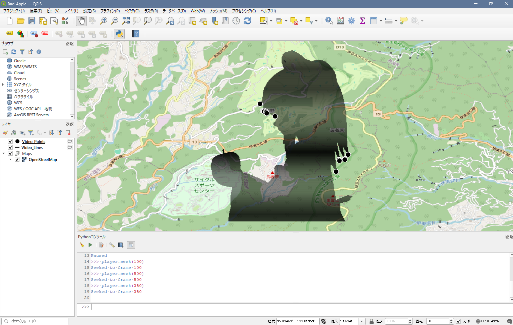

<div align="center">
    <br>
    <h3>- Playing Bad Apple on QGIS -</h3>
    <p>Sakamochanq</p>
    <br>
    <a href="#">
        
    </a>
    <br>
    <br>
    <br>
</div>

## Summary

This project demonstrates how to play the iconic Bad Apple video using QGIS's spatial
data visualization capabilities. The video's frames are represented as a series of 
geospatial data points, allowing for a unique and creative experience of animation
within a GIS environment.

But, it's not just for Bad Apple you can play any mp4 video 🤫.

<br>

## How to Run

git clone

```
git clone https://github.com/Sakamochanq/qgis-badapple.git
```

<br>
<br>

Install the required dependencies using the following command.

```
uv sync
```

<br>
<br>

Load `main.py` from the QGIS Python Console using the following command.

```py
exec(open('[YourPath]/qgis-badapple/src/main.py').read())
```

<br>
<br>

Use the following command to set the video you want to draw.

```py
player = set_video('[YourVideoPath].mp4')
```

<br>
<br>

## Features

Command | Description
--- | ---
`play` | Start playing the video.
`pause` | Pause the video playback.
`stop` | Stop the video playback.
`seek` | Seek to a specific frame in the video.

### Example

```py
player = set_video('[YourVideoPath].mp4')
player.play()
# and so on...
player.seek(100)  # Seek to frame 100
```

<br>
<br>

## Author


* [Sakamochanq](https://github.com/Sakamochanq)  - Developer  

    * [Github Copilot](https://github.com/features/copilot/) - AI Assistant

        * [Claude Opus 4.5](https://claude.ai/) - Model

<br>
<br>

## License

Released under the [MIT](./LICENSE) License.
